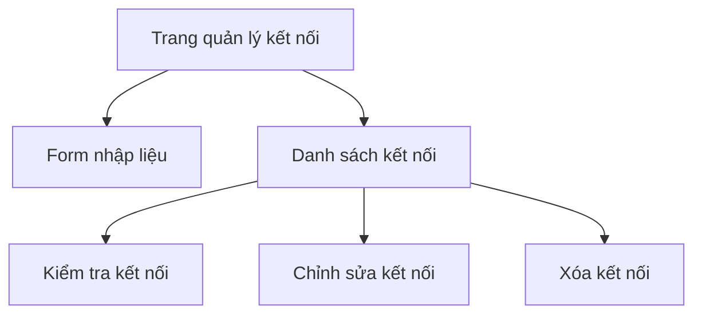

## 1. Product Overview
Ứng dụng quản lý kết nối FTP giúp người dùng lưu trữ và quản lý thông tin kết nối FTP một cách an toàn. Sản phẩm giải quyết vấn đề quản lý nhiều kết nối FTP, bảo mật thông tin đăng nhập, và kiểm tra kết nối nhanh chóng.

## 2. Core Features

### 2.1 User Roles
Không yêu cầu phân quyền người dùng - ứng dụng đơn giản cho phép bất kỳ ai sử dụng mà không cần đăng ký.

### 2.2 Feature Module
Ứng dụng gồm các trang chính sau:
1. **Trang quản lý kết nối**: Hiển thị danh sách kết nối FTP đã lưu, form thêm/sửa kết nối, kiểm tra kết nối.

### 2.3 Page Details
| Page Name | Module Name | Feature description |
|-----------|-------------|---------------------|
| Trang quản lý kết nối | Danh sách kết nối | Hiển thị danh sách các kết nối FTP đã lưu với thông tin server, port, username, thư mục đích và trạng thái kết nối. Cho phép xóa từng kết nối. |
| Trang quản lý kết nối | Form nhập liệu | Cho phép nhập địa chỉ server FTP, port kết nối, tên đăng nhập, mật khẩu (ẩn dưới dạng dấu *), thư mục đích. Có nút lưu để thêm mới hoặc cập nhật kết nối. |
| Trang quản lý kết nối | Kiểm tra kết nối | Nút kiểm tra kết nối cho từng kết nối trong danh sách, hiển thị thông báo thành công/thất bại. |
| Trang quản lý kết nối | Thông báo | Hiển thị thông báo khi thêm, sửa, xóa kết nối thành công hoặc thất bại. |

## 3. Core Process
Người dùng mở ứng dụng → Xem danh sách kết nối FTP đã lưu → Có thể thêm mới kết nối bằng cách nhập thông tin và nhấn lưu → Có thể chỉnh sửa kết nối hiện có bằng cách nhấn vào kết nối trong danh sách → Có thể xóa kết nối không cần thiết → Có thể kiểm tra kết nối bất kỳ lúc nào.

## 4. User Interface Design

### 4.1 Design Style
- Màu chính: Xanh dương (#2563eb) cho nút chính và header
- Màu phụ: Xám nhạt (#f3f4f6) cho nền và viền
- Button style: Rounded corners với shadow nhẹ, hover effect
- Font: Inter hoặc system font, kích thước 14-16px cho nội dung chính
- Layout: Card-based với grid layout cho danh sách kết nối
- Icon: Sử dụng Heroicons hoặc Font Awesome cho icon FTP, server, connection status

### 4.2 Page Design Overview
| Page Name | Module Name | UI Elements |
|-----------|-------------|-------------|
| Trang quản lý kết nối | Danh sách kết nối | Card layout hiển thị từng kết nối với: tên server in đậm, port và username nhỏ hơn, icon trạng thái màu xanh/đỏ, nút kiểm tra kết nối màu xanh, nút xóa màu đỏ. Grid 2-3 cột trên desktop. |
| Trang quản lý kết nối | Form nhập liệu | Form nằm phía trên hoặc bên trái với các input field có label rõ ràng, password field có toggle show/hide, nút lưu màu xanh dương. Form có border radius và shadow. |
| Trang quản lý kết nối | Thông báo | Toast notification xuất hiện ở góc trên bên phải, tự động ẩn sau 3 giây, có màu xanh cho success và đỏ cho error. |

### 4.3 Responsiveness
Desktop-first design, responsive cho tablet và mobile. Trên mobile chuyển sang single column layout, form full width, danh sách kết nối stack vertical.