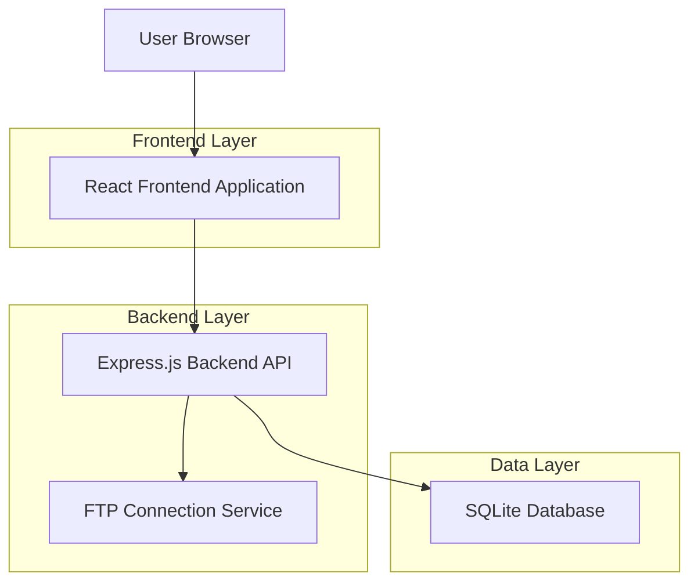
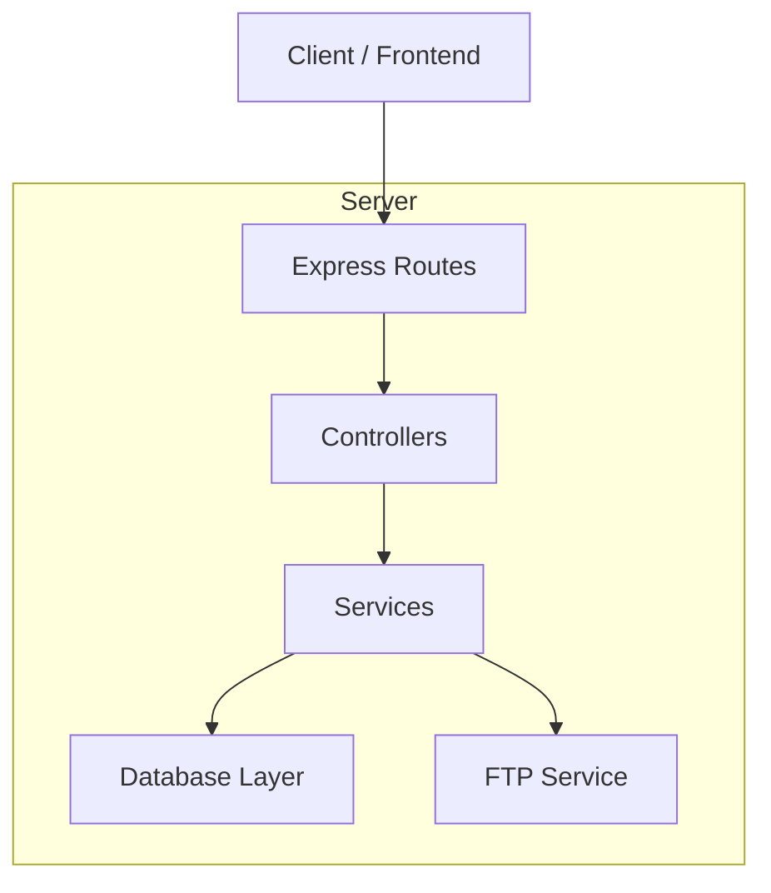
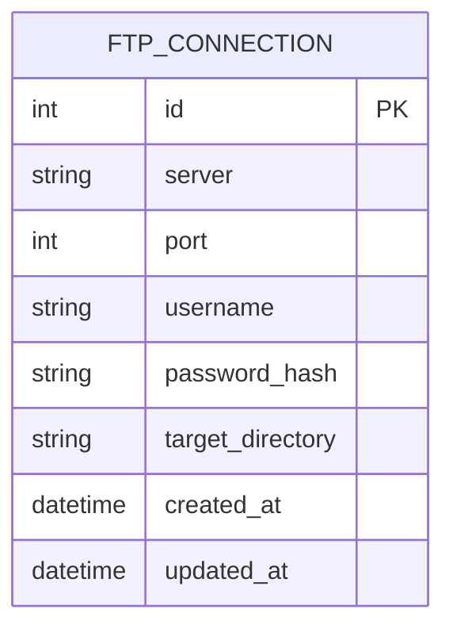

## 1. Architecture design



## 2. Technology Description

- Frontend: React@18 + tailwindcss@3 + vite
- Initialization Tool: vite-init
- Backend: Express@4
- Database: SQLite (file-based)
- Password Encryption: bcrypt
- FTP Client: basic-ftp

## 3. Route definitions

| Route | Purpose |
|-------|---------|
| / | Trang quản lý kết nối chính, hiển thị danh sách và form |
| /api/ftp-connections | API CRUD cho kết nối FTP |
| /api/ftp-connections/test | API kiểm tra kết nối FTP |

## 4. API definitions

### 4.1 Core API

**Lấy danh sách kết nối FTP**
```
GET /api/ftp-connections
```

Response:
```json
[
  {
    "id": 1,
    "server": "ftp.example.com",
    "port": 21,
    "username": "user1",
    "password": "encrypted_password",
    "targetDirectory": "/public_html",
    "createdAt": "2024-01-15T10:00:00Z"
  }
]
```

**Tạo kết nối FTP mới**
```
POST /api/ftp-connections
```

Request:
| Param Name| Param Type  | isRequired  | Description |
|-----------|-------------|-------------|-------------|
| server    | string      | true        | Địa chỉ server FTP |
| port      | number      | true        | Port kết nối (mặc định 21) |
| username  | string      | true        | Tên đăng nhập |
| password  | string      | true        | Mật khẩu (sẽ được mã hóa) |
| targetDirectory | string | false   | Thư mục đích |

**Cập nhật kết nối FTP**
```
PUT /api/ftp-connections/:id
```

**Xóa kết nối FTP**
```
DELETE /api/ftp-connections/:id
```

**Kiểm tra kết nối FTP**
```
POST /api/ftp-connections/test
```

Request:
| Param Name| Param Type  | isRequired  | Description |
|-----------|-------------|-------------|-------------|
| server    | string      | true        | Địa chỉ server FTP |
| port      | number      | true        | Port kết nối |
| username  | string      | true        | Tên đăng nhập |
| password  | string      | true        | Mật khẩu |

Response:
```json
{
  "success": true,
  "message": "Kết nối thành công"
}
```

## 5. Server architecture diagram



## 6. Data model

### 6.1 Data model definition



### 6.2 Data Definition Language

**FTP Connections Table (ftp_connections)**
```sql
-- create table
CREATE TABLE ftp_connections (
  id INTEGER PRIMARY KEY AUTOINCREMENT,
  server VARCHAR(255) NOT NULL,
  port INTEGER DEFAULT 21,
  username VARCHAR(100) NOT NULL,
  password_hash VARCHAR(255) NOT NULL,
  target_directory VARCHAR(500),
  created_at DATETIME DEFAULT CURRENT_TIMESTAMP,
  updated_at DATETIME DEFAULT CURRENT_TIMESTAMP
);

-- create index
CREATE INDEX idx_ftp_connections_server ON ftp_connections(server);
CREATE INDEX idx_ftp_connections_username ON ftp_connections(username);
```

**Password Encryption Logic**
```javascript
// Sử dụng bcrypt cho mã hóa password
const bcrypt = require('bcrypt');
const saltRounds = 10;

// Mã hóa password trước khi lưu
const hashedPassword = await bcrypt.hash(plainPassword, saltRounds);

// Giải mã khi cần sử dụng
const isValid = await bcrypt.compare(inputPassword, hashedPassword);
```